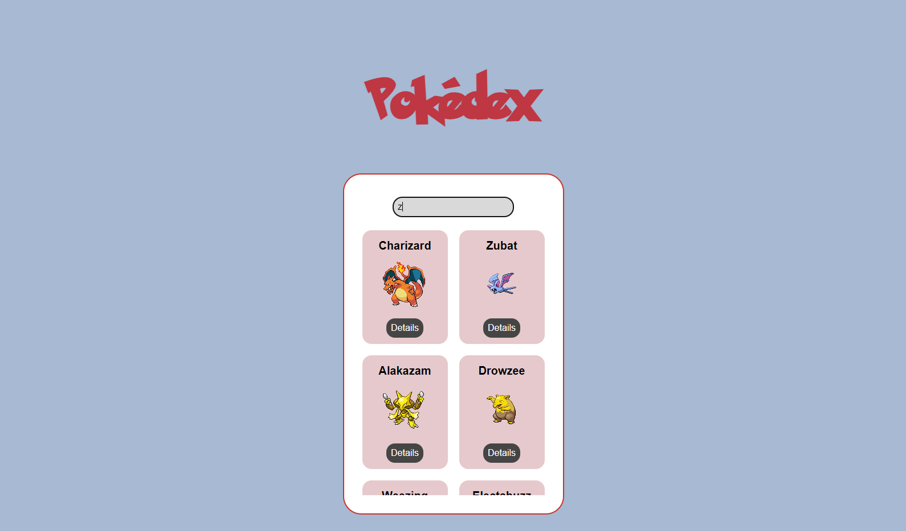

# Pokedex App

Voici une application Pokedex qui permet de découvrir les Pokemons avec leurs spécificités.

## Fonctions disponibles

Dans ce projet, vous pourrez utilisez :

### Une page d'accueil avec la liste des Pokemons

Lorsque vous ouvrez l'application, vous entrez dans la page d'accueil.
Vous pouvez déjà découvrir une liste limitée de Pokémons.

Si vous en cherchez un en particulier, vous pouvez taper le nom dans la barre de recherche pour le trouver.
Il apparaitra alors sur la page. Vous souhaitez en apprendre plus sur lui? Cliquez sur "Détails".

### Une page de carte Pokemon

Lorsque vous cliquez sur "Détails", vous êtes directement redirigé vers la carte du Pokémon.
Dedans, vous y trouverez différentes informations propres au Pokémon.

## Projet en cours

Ce projet est en cours de développement.
Vous pouvez pour l'instant découvrir une liste de Pokemon, en utilisant la barre de recherche et découvrir la carte des pokémons.
