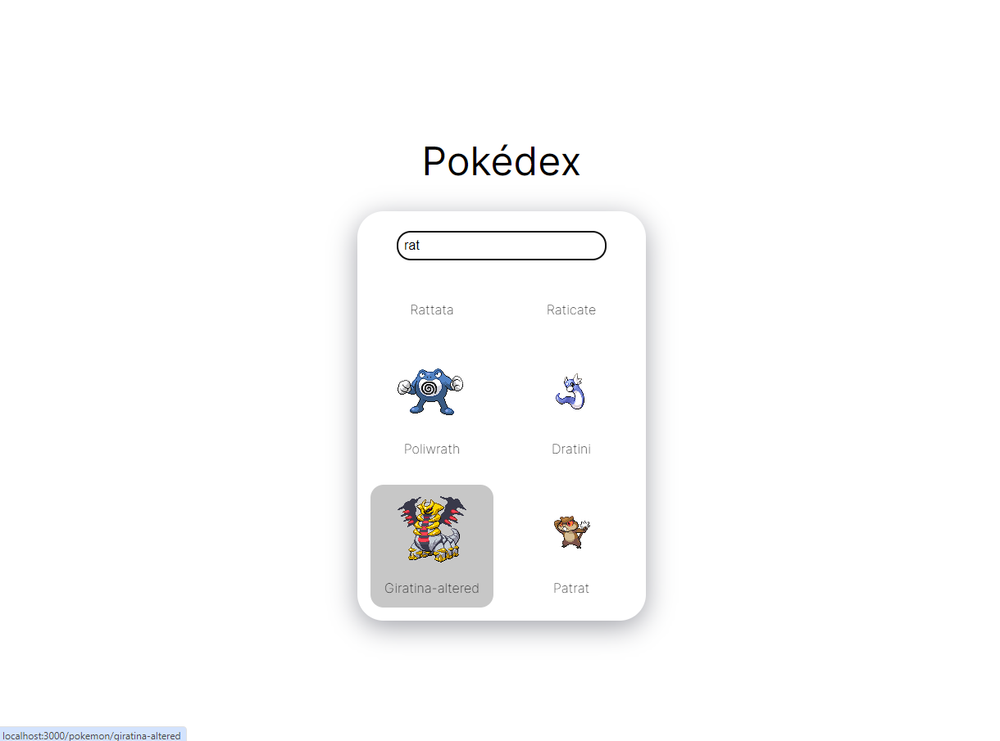
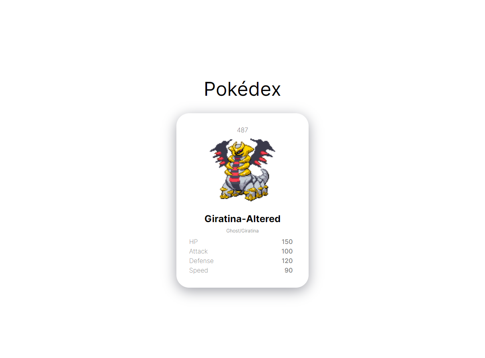

# Pokédex

Encyclopédie numérique qui recense les créatures de l'univers Pokémon, avec leurs attributs.

## Fonctions

- Recherche par nom
- Catalogue de Pokémons
- Fiche détaillée du Pokémons

## Technologies

- HTML
- CSS
- React

Récupération des données via PokeAPI.

## Utilisation

Essayez l'application en suivant ce lien :

https://apolline-diaz.github.io/Pokedex/

Cliquez sur le titre "Pokédex", une barre de recherche apparait !
Entrez le nom de votre pokémon ou un mot et explorez le catalogue.
Une liste de Pokémons s'affiche automatiquement (pas besoin d'appuyer sur "entrer").
Cliquez sur un pokémon pour découvrir ses attributs.

Pour revenir à la barre de recherche, il suffit de cliquer à nouveau sur "Pokédex".

